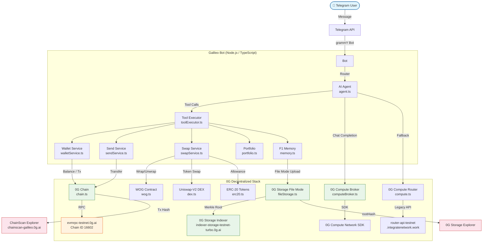

# 0G Integration Reference

> **Single source of truth for auditing every 0G touchpoint in Galileo.**
> Every link opens a live explorer page. All addresses are annotated with their
> environment variable so you can verify against any running instance.

> **Galileo is the verifiable AI wallet on 0G.** This document exists because 0G is not
> a feature of Galileo — it is the precondition for any sensitive action to execute. Every
> layer below answers a single question: **what breaks if 0G is removed?**
>
> - **Without 0G Compute**, the AI's reasoning has no hardware-attested proof → no TEE leg.
> - **Without 0G Chain**, there is no deterministic settlement for the executed intent.
> - **Without 0G Storage**, the Verified Intent Receipt has no immutable home → no public
>   verification link, no judge-verifiable audit trail.
>
> Remove any one layer and Galileo cannot credibly claim to be a verifiable AI wallet.

---

## Architecture Overview

> 📊 See [docs/architecture.svg](docs/architecture.svg) for the full visual architecture diagram with SDK calls and file paths.



---

## 1. 0G Chain (evm)

| Property | Value | Source |
|---|---|---|
| **Chain Name** | 0G Galileo Testnet | — |
| **Chain ID** | `16602` | `config.OG_CHAIN_ID` |
| **RPC URL** | `https://evmrpc-testnet.0g.ai` | `config.OG_RPC` (default) |
| **Explorer** | [chainscan-galileo.0g.ai](https://chainscan-galileo.0g.ai) | — |
| **Operator Wallet** | Derived from `OPERATOR_PRIVATE_KEY` | `chain.ts:operatorWallet` |
| **Token** | OG (native, 18 decimals) | — |
| **Faucet** | [faucet.0g.ai](https://faucet.0g.ai) | — |

### Usage in code

```typescript
// src/og/chain.ts
const provider = new JsonRpcProvider(config.OG_RPC, network, { staticNetwork: network });
const operatorWallet = new Wallet(config.OPERATOR_PRIVATE_KEY, provider);
```

- All native OG transfers use `signer.sendTransaction()`
- Balances use `provider.getBalance(address)`
- Gas is paid by the operator wallet (pre-funded at deploy time)

---

## 2. 0G Storage — File Mode (primary)

Used for **F1 Permanent Memory, wallet persistence, and the username index** —
every user's conversation history, wallet list, and @handle→userId snapshot are
stored as rolling snapshot files on 0G Storage through the same
`uploadJson`/`downloadJson` API.

| Property | Value | Source |
|---|---|---|
| **Indexer RPC** | `https://indexer-storage-testnet-turbo.0g.ai` | `config.OG_INDEXER_RPC` |
| **Flow Contract (Explorer)** | [View on ChainScan](https://chainscan-galileo.0g.ai/address/0x22E03a6A89B950F1c82ec5e74F8eCa321a105296) | shared 0G infrastructure (used by `indexer.upload`) |
| **Storage Explorer** | [scan.0g.ai](https://scan.0g.ai) | — |
| **Local Index** | `OG_STORAGE_INDEX_PATH` (default: beside `WALLET_STORE_PATH`) | `fileStorage.ts` |

### Architecture

```
User Message
    │
    ▼
memory.ts ──► uploadJson(userId, history)
                    │
                    ▼
            fileStorage.ts
                    │
                    ├── merkleTree()
                    ├── indexer.upload(memData, RPC, wallet)
                    │       │
                    │       ▼
                    │   0G Storage (permanent, immutable)
                    │
                    └── rootHashIndex[userId] = tx.rootHash
                        │
                        ▼
                    OG_STORAGE_INDEX_PATH (local JSON cache)
```

### Verify a snapshot

1. Get the user's latest `rootHash` from `OG_STORAGE_INDEX_PATH`.
2. Open [scan.0g.ai](https://scan.0g.ai) and paste the rootHash.
3. Or use the 0G CLI: `0g-storage-client download --root <rootHash> --proof`

---

## 3. Username Registry (@handle → userId Resolution)

An in-memory index that maps Telegram `@username` handles to numeric Telegram
userIds. Recorded passively from every incoming message and used to resolve
send recipients (e.g. `send 0.1 OG to @alice`).

| Property | Value | Source |
|---|---|---|
| **Index type** | In-memory `Map<string, { userId, lastSeen }>` | `usernameIndex.ts` |
| **Persistence** | None — rebuilt on each bot restart as users send messages | — |
| **Collision** | Last writer wins — a handle that changes hands resolves to whoever spoke most recently | — |
| **Normalization** | Trimmed, leading `@` stripped, lowercased | `usernameIndex.ts:normalize()` |

### Files

| File | Purpose |
|---|---|
| `src/wallet/usernameIndex.ts` | Core index: `record()`, `lookup()`, `count()`, `clear()` |
| `src/wallet/usernameIndex.test.ts` | Unit tests (case-insensitivity, trimming, overwrite, null-guard) |
| `src/wallet/recipientResolver.ts` | `resolveRecipientToAddress()` — resolves `@handle` or `0x...` → wallet address |
| `src/wallet/recipientResolver.test.ts` | Unit tests (address, username, not_found, no_wallets, isSelf branches) |

### Flow

```
Incoming message from @alice
    │
    ▼
bot.ts username-recorder middleware
    │  ctx.from.username → usernameIndex.record('@alice', '12345')
    │  (fires for EVERY message, never short-circuits)
    ▼
usernameIndex.ts
    │  normalize('@alice') → 'alice'
    │  index.set('alice', { userId: '12345', lastSeen: Date.now() })
    ▼
    In-memory Map ready for lookup

Later: user types "send 0.1 OG to @alice"
    │
    ▼
sendUiHandlers.ts → parseSendText() → '@alice'
    │
    ▼
recipientResolver.ts → resolveRecipientToAddress('@alice', senderUserId)
    │  ├── usernameIndex.lookup('alice') → '12345'
    │  ├── walletStore.list('12345') → wallets[]
    │  ├── getActiveId('12345') → active wallet (or wallets[0])
    │  └── return { kind: 'username', address: 0x..., username: 'alice', ... }
    ▼
    Address resolved → stage send → Confirm/Cancel buttons
```

### API

```typescript
// src/wallet/usernameIndex.ts

/** Record (or refresh) the userId for a given @username. */
record(username: string | null | undefined, userId: string): void

/** Resolve a @username to its currently associated userId. Returns null when unknown. */
lookup(username: string): string | null

/** Number of distinct usernames currently held in the index. */
count(): number

/** Drop every entry from the index (tests / clean shutdown). */
clear(): void
```

### Return types (recipientResolver)

```typescript
type ResolvedRecipient =
  // Raw 0x address (passed through as-is)
  | { kind: 'address'; address: string; isSelf: false }
  // @username resolved to wallet address
  | { kind: 'username'; address: string; username: string; recipientUserId: string; isSelf: boolean }
  // Could not find this handle in the index
  | { error: 'not_found' }
  // Handle found, but user has no wallets yet
  | { error: 'no_wallets' };
```

### Architecture (in-memory + optional 0G Storage persistence)

The registry holds a `Map<normalized-handle, { userId, lastSeen }>` in process memory. The Map is **always** the source of truth at runtime — lookups are instant (`index.get(...)`), no I/O.

The persistence layer is layered additively on top of the in-memory Map:

```
On startup:    await usernameIndex.hydrate()
                 ├─ OG_STORAGE_ENABLED?       → load from 0G Storage → populate Map
                 └─ disabled / fails           → Map stays empty, rebuilds from messages

On record():   Map.set(key, entry)             ← sync, in-memory
                 └─ void persist()              ← fire-and-forget, never blocks caller
                                                  (no-op when OG_STORAGE_ENABLED=false)

On lookup():   Map.get(key)?.userId            ← sync, in-memory, no I/O
```

**Why the in-memory Map is always the source of truth** (and not just read 0G Storage directly):

- **Privacy by construction** — the registry holds Telegram `@username → userId` mappings transiently. Even with persistence enabled, the in-memory copy is the only thing the process touches per message; 0G Storage is a warm-cache for cold starts, not a real-time data plane.
- **Self-healing** — every incoming message re-records the handle. There is no "restore from backup" procedure, no consistency check between storage and memory, and no corrupted-state failure mode.
- **Zero per-message latency** — `lookup()` is a synchronous `Map.get`, unaffected by 0G Storage availability.
- **Trivially horizontally scalable** — when you eventually run multiple bot instances (HA, blue-green, A/B), they all converge to the same index state through normal message traffic, with no leader election, shared cache, or eventual-consistency lag.
- **Zero ops burden** — no TTL pruning, no schema versioning, no backup/restore drills. The in-memory Map is bounded by recent-active handles; persistence is a snapshot, not a log.

### Persistence layer (optional)

When `OG_STORAGE_ENABLED=true`:

- `hydrate()` at startup reads the latest index snapshot from 0G Storage and populates the in-memory Map. Typically <1s for a small JSON file.
- Every `record()` call fires a non-blocking `persist()` that uploads the current Map state via `uploadJson(STORAGE_KEY, snapshot)`. The upload runs on the event loop and never blocks the caller.
- If `OG_STORAGE_ENABLED=false`, both `hydrate()` and `persist()` are no-ops; the registry works exactly as the original in-memory-only design.
- If 0G Storage is unavailable mid-session, `persist()` logs a warning and the in-memory Map continues to serve lookups. The next successful `record()` will retry the upload.

### Trade-off (intentional)

With persistence disabled, `/send @handle` may fail after a restart for handles whose owners haven't sent a new message yet. With persistence enabled, `hydrate()` closes that cold-start window. The shipped default is `OG_STORAGE_ENABLED=true`; flip it off for environments that want to avoid storage costs.

---

## 4. 0G Compute Network (TEE-verified Inference)

| Property | Value | Source |
|---|---|---|
| **SDK** | `@0gfoundation/0g-compute-ts-sdk` | `package.json` |
| **Model** | `qwen/qwen2.5-omni-7b` | `config.OG_COMPUTE_MODEL` |
| **API Key** | `OG_COMPUTE_API_KEY` (from [pc.testnet.0g.ai](https://pc.testnet.0g.ai)) | — |
| **Provider** | Discovered on-chain at startup; filtered: `serviceType=chatbot` + `verifiability=TeeML` | `computeBroker.ts` |
| **Provider Override** | `OG_COMPUTE_PROVIDER_ADDRESS` (optional) | — |
| **Fund Amount** | `OG_COMPUTE_FUND_AMOUNT` (default `1` OG) | — |
| **Fallback URL** | `https://router-api-testnet.integratenetwork.work/v1` | `config.OG_COMPUTE_BASE_URL` |
| **Fallback Mode** | `OG_COMPUTE_FALLBACK=true` (disables TEE verification) | — |

### Flow

```
chatVerified(messages, tools)
    │
    ├── Fallback mode? ──► legacy OpenAI client (no verification)
    │
    └── Default (SDK)
            │
            ├── getBroker().inference.getServiceMetadata(providerAddress)
            │       → endpoint + model
            │
            ├── getBroker().inference.getRequestHeaders(providerAddress, content)
            │       → signed billing headers
            │
            ├── POST {endpoint}/chat/completions (raw fetch)
            │       → response body + ZG-Res-Key header (chatID)
            │
            └── getBroker().inference.processResponse(providerAddress, chatID)
                    → true (verified) | false (failed) | null (error)
```

### Selected Provider

The active provider address is logged at startup:
```
[startup] 0G Compute broker ready · provider=0x... · model=qwen/qwen2.5-omni-7b
```

It can also be read at runtime by calling `getActiveProviderAddress()` from
`computeBroker.ts`.

---

## 5. Deployed Contracts (Galileo Testnet — Live)

These are the **current** addresses for the live Galileo testnet deployment, verified on-chain via `eth_getCode`. The full deploy flow is in `scripts/`:

| Contract | Env Var | Galileo Testnet Address | ChainScan |
|---|---|---|---|
| **WOG (Wrapped OG)** — WETH9 clone | `WOG_ADDRESS` | `0x736e2De310439dDa0173EA131C44bf7dc6Dd519B` | [View](https://chainscan-galileo.0g.ai/address/0x736e2De310439dDa0173EA131C44bf7dc6Dd519B) |
| **DEX Factory** — Uniswap-V2 | `DEX_FACTORY_ADDRESS` | `0xcA3df043c64Fa3EfD8d9206074f7Fb253204edA5` | [View](https://chainscan-galileo.0g.ai/address/0xcA3df043c64Fa3EfD8d9206074f7Fb253204edA5) |
| **DEX Router** — Uniswap-V2 | `DEX_ROUTER_ADDRESS` | `0xfacFC430Af0C00A596655CE7cDA1685E85C40487` | [View](https://chainscan-galileo.0g.ai/address/0xfacFC430Af0C00A596655CE7cDA1685E85C40487) |
| **USDC (demo)** — Mock 18-dec ERC-20 | `USDC_ADDRESS` | `0x0C2063067cc5a67860793d53a2f9a22248f37396` | [View](https://chainscan-galileo.0g.ai/address/0x0C2063067cc5a67860793d53a2f9a22248f37396) |
| **USDT (demo)** — Mock 18-dec ERC-20 | `USDT_ADDRESS` | `0x1637e005faF71226D34b5f12AA069FE5C06B6495` | [View](https://chainscan-galileo.0g.ai/address/0x1637e005faF71226D34b5f12AA069FE5C06B6495) |

> **Note:** These addresses are bound to the env vars above and to the `.env` of the running instance. To redeploy, run the scripts below and update the secrets — old deployments remain on-chain at the addresses shown here for historical reference. The 0G Storage Flow contract (above, §2) is shared infrastructure and is not redeployed by this bot.

These are deployed by scripts in `scripts/`:

| Script | Deploys | Command |
|---|---|---|
| `scripts/deployWog.ts` | WOG | `WOG_ADDRESS=0x.. npx tsx scripts/deployWog.ts` |
| `scripts/deployMockTokens.ts` | USDC + USDT | `npx tsx scripts/deployMockTokens.ts` |
| `scripts/deployDex.ts` | Factory + Router | `WOG_ADDRESS=0x.. npx tsx scripts/deployDex.ts` |
| `scripts/seedLiquidity.ts` | OG<->USDC/USDT pools | See script header |

### Verification

```bash
# Check if a contract is deployed at an address
curl -s https://evmrpc-testnet.0g.ai \
  -H "Content-Type: application/json" \
  -d '{"jsonrpc":"2.0","method":"eth_getCode","params":["0x...","latest"],"id":1}'
# → "0x..." (non-empty bytecode = deployed)
```

---

## 6. Transaction & Proof Trail

Every on-chain action generates a verifiable trail:

| Action | On-chain Artifact | Explorer | Storage Record |
|---|---|---|---|
| **Token transfer** | Tx hash (native OG send) | [ChainScan](https://chainscan-galileo.0g.ai/tx/${TX_HASH}) | `StoredTx` in user snapshot |
| **Swap (wrap/unwrap)** | Tx hash (WOG deposit/withdraw) | [ChainScan](https://chainscan-galileo.0g.ai/tx/${TX_HASH}) | `StoredTx` in user snapshot |
| **Swap (DEX)** | Tx hash (router swap) | [ChainScan](https://chainscan-galileo.0g.ai/tx/${TX_HASH}) | `StoredTx` in user snapshot |
| **Memory snapshot** | Storage root hash | [scan.0g.ai](https://scan.0g.ai) (paste rootHash) | `OG_STORAGE_INDEX_PATH` |
| **AI reply** | TEE chatID | Verified via `processResponse()` | `StoredProof` in user snapshot |
| **Verified Intent Receipt (F5)** | Storage root hash (`receipt:<id>`) | [`/verify/:root`](https://galileo-test.fly.dev/verify/) | `OG_RECEIPT_INDEX_PATH` |

### Verified Intent Receipts (F5) — the canonical proof artifact

The receipt is the single artifact that proves an end-to-end user action: *natural-language
intent → deterministic parse → risk checks → explicit confirmation → on-chain tx → 0G Storage
root*. It is the dominant primitive of Galileo — **no value moves without one.**

| Action type | Lifecycle | On 0G Storage? | Receipt status |
|---|---|---|---|
| `send`, `swap` | stage (pre-Confirm) → finalize (post-tx) | ✅ on finalize | `staged` → `executed` / `cancelled` / `failed` |
| `dca` | create-and-upload (creation); create-and-upload (each execution) | ✅ both | `created` / `executed` |
| `alert` | create-and-upload (arming); create-and-upload (fire) | ✅ both | `armed` / `fired` |
| `key_reveal` | create-and-index (local-only) | ❌ never | `revealed` |

Each receipt is uploaded under its own namespace (`receipt:<receiptId>`), making it
independently recoverable via `/verify/:rootHash` — immune to the rolling memory snapshot's
`MAX_ENTRIES` compaction. Key-reveal receipts are deliberately local-only (sensitive metadata
about key reveals should not live on public immutable storage).

**Parent→child receipt chain (DCA + alerts):** DCA creation and alert arming receipts store
their `receiptId` on the intent itself (`creationReceiptId`). When the worker executes a DCA
tick or an alert fires, the execution/fire receipt links back to the creation receipt via
`intentLink.creationReceiptId` — so a judge can verify the full chain from *"user said 'dca 1
OG into USDC weekly'"* → *"rule was archived"* → *"each tick executed on 0G Chain"* → *"each
execution receipt links to the same parent root"*. The Proof Center renders this link at
`/verify/:root` under "Creation Receipt".

**Compute leg on receipts:** DCA creation and alert arming receipts carry a `compute` field
(`{ provider, verified, chatId }`) when the intent was created via the AI agent path. This is
populated from the TEE verification metadata of the LLM call that triggered the tool — no
additional 0G Compute request is made. When the intent is created via the deterministic parser
path (`intentUiHandlers.ts`), `compute` is `null` (no LLM was involved). Send/swap receipts
also carry `compute: null` today — they are deterministic command flows, not AI tools.

- **Schema**: `src/receipts/types.ts` (Zod-validated discriminated union on `actionType`)
- **Service**: `src/receipts/receiptService.ts` (stage / finalize / emit / cancel / fail)
- **Index**: `src/receipts/receiptStore.ts` → `OG_RECEIPT_INDEX_PATH` (receiptId → rootHash)
- **List**: `/receipt` in Telegram; **Verify**: [`/verify/:root`](https://galileo-test.fly.dev/verify/) in any browser

### `/proof` command output

```
🔐 Recent verified chats (3)
✓ verified  `6/30/26, 11:15 PM UTC`  0xabcd1234…ef5678  (provider 0xAbCd…Ef01)
✓ verified  `6/30/26, 10:30 PM UTC`  0x9876fedc…ba5432  (provider 0xAbCd…Ef01)
⏳ pending  `6/30/26, 9:00 PM UTC`   0x4567abcd…1234ef  (provider 0xAbCd…Ef01)
```

---

## 7. Proof Index (Public Audit Feed)

A `public/proofs.json` file exposes the last **50 user-anonymized** proof samples across all users. Each entry contains:

- **txHash** — on-chain transaction hash with ChainScan link
- **storageRootHash** — 0G Storage snapshot root hash with explorer link
- **teeChatID** — TEE-verified chat ID from 0G Compute

Served at: `/proofs` on the health endpoint.

### Scheduler

- **GitHub Actions** (`.github/workflows/proofs.yml`) runs `npm run generate-proofs` every 6 hours via the `schedule:` trigger and commits the result back when it contains data. The workflow uses dummy env vars to satisfy `config.ts` validation (the script never signs anything — it only reads from 0G Storage), and skips the commit when the script returns an empty index. This makes the CI run a **heartbeat that proves the pipeline works** without ever overwriting a real `proofs.json` with empty content.
- **Real proof regeneration** (with user data) happens on the **Fly machine**, where the persistent volume holds `OG_STORAGE_INDEX_PATH`. Trigger it on demand with:

  ```bash
  fly ssh console --app <app-name> --command "npm run generate-proofs"
  ```

- **Manual run anywhere**: `npm run generate-proofs`.

### Privacy

- `userHash` values are salted SHA-256 (`createHash('sha256').update(salt + ':' + userId)`), not the previous non-crypto char-code hash. The salt is read from `PROOFS_HASH_SALT` and must stay **stable** across regenerations so the same userId produces the same `userHash` — this preserves the audit trail ("this is the same user as last week" without revealing who).
- Set the salt via `fly secrets set PROOFS_HASH_SALT=$(openssl rand -hex 32)`. Without it, `scripts/generateProofIndex.ts` falls back to a dev-only string and logs a warning in production. CI uses a dummy salt via `.github/workflows/proofs.yml` (never touches real data).
- `teeChatID` is exposed raw — it's a TEE session ID, not a user identifier. Correlating it requires the 0G Compute provider's logs, which are out of scope for this public feed.
- `txHash`, `chainscanLink`, `storageRootHash`, and `storageExplorerLink` are intentionally full-length so anyone can click through to ChainScan / 0G Storage explorer and verify the proof independently. Privacy here comes from `userHash` being the only link between a proof and a user.

---

## 8. Health Endpoint

| Property | Value |
|---|---|
| **Port** | `8080` (configurable via `PORT` env) |
| **Endpoint** | `GET /health` → `{"status":"ok","uptime":N}` |
| **Endpoint** | `GET /` → `{"status":"ok","uptime":N}` (alias for /health) |
| **Endpoint** | `GET /proofs` → Public Proof Center live feed (HTML) |
| **Endpoint** | `GET /proofs.json` → Raw JSON proof index (legacy, backward compat) |
| **Endpoint** | `GET /status` → Health dashboard (compute TEE status, chain block #, storage, uptime) |
| **Endpoint** | `GET /intents/live` → DCA & alert executions with status badges, timestamps, tx links |
| **Endpoint** | `GET /verify/:root` → Recover and verify a receipt from 0G Storage by root hash or user ID |
| **Uptime Monitor** | UptimeRobot / Better Stack on `/health` |

---

## 9. Quick Verification Checklist

For auditors / judges — verify each integration in 2 clicks:

- [ ] **Chain**: Open [chainscan-galileo.0g.ai](https://chainscan-galileo.0g.ai) → search operator wallet address → shows funded + tx history
- [ ] **Storage**: Open [scan.0g.ai](https://scan.0g.ai) → paste any rootHash from `OG_STORAGE_INDEX_PATH` → shows snapshot
- [ ] **Compute**: Run `/proof` in the bot → each chatID can be verified via `processResponse()` in the SDK
- [ ] **Flow Contract**: [ChainScan link](https://chainscan-galileo.0g.ai/address/0x22E03a6A89B950F1c82ec5e74F8eCa321a105296) → shows Storage contract bytecode
- [ ] **DEX**: [ChainScan — Router](https://chainscan-galileo.0g.ai/address/0xfacFC430Af0C00A596655CE7cDA1685E85C40487) → shows UniswapV2Router02 bytecode
- [ ] **WOG**: [ChainScan](https://chainscan-galileo.0g.ai/address/0x736e2De310439dDa0173EA131C44bf7dc6Dd519B) → shows WETH9 bytecode
- [ ] **Proofs Index**: `GET /proofs` → JSON file with recent samples
- [ ] **Portfolio**: Run `/portfolio` in the bot → shows USD-priced breakdown + grand total

---

## 10. Portfolio, Pricing & Stats

The bot ships a full portfolio-tracking layer on top of the wallet service. All three pieces are **pure-read** against the chain — no new contract interactions beyond what `walletService` already does.

### Commands

| Command | Source | Description |
|---|---|---|
| `/portfolio` | `src/handlers/portfolioHandlers.ts` | Renders all wallets with USD prices + grand total. Also records a daily snapshot (see below). |
| `/price <symbol\|coingecko-id>` | `src/handlers/portfolioHandlers.ts` | Quick USD price lookup for any tracked token or arbitrary CoinGecko id. |
| `/history [day\|week\|month]` | `src/handlers/portfolioHandlers.ts` | Renders a P&L table from the user's daily snapshots; baseline = oldest snapshot in range. |

The same flows are reachable via natural language; the AI agent has dedicated tools (`get_price`, `transaction_stats`) to answer "how much is X?", "how many transactions have I done?", etc.

### CoinGecko price feed

`src/og/prices.ts` fetches USD prices from the public CoinGecko API:

- Endpoint: `https://api.coingecko.com/api/v3/simple/price?ids=...&vs_currencies=usd`
- Cache TTL: **60 seconds** (per symbol/id)
- Tracked symbols: `OG`, `WOG`, `USDC`, `USDT`
- Arbitrary lookup: `/price <coingecko-id>` (e.g. `bitcoin`, `ethereum`) bypasses the symbol map

No API key required. If CoinGecko is unavailable, prices render as `—` and the portfolio grand total falls back to `null` — the bot never crashes on a price-fetch failure.

### Daily snapshots

`src/analytics/snapshot.ts` writes a JSON snapshot per user to `.data/snapshots/<userId>.json` each time `/portfolio` is called (one snapshot per day, overwritten on repeat calls within the same day):

```json
[
  { "date": "2026-06-30", "totalUsd": 280.5, "assets": [...], "ts": 1719792000000 },
  { "date": "2026-06-29", "totalUsd": 275.0, "assets": [...], "ts": 1719705600000 }
]
```

Snapshots are **local-only by design** (ephemeral analytics, not canonical records) — writing to 0G Storage per call would cost unnecessary gas. `/history` reads from this file.

### `transaction_stats` tool

Defined in `src/ai/tools.ts`. Returns:

```typescript
{
  onChainTxCount: number,      // true on-chain tx count sent from the user's wallets (from chain)
  recordedCount: number,       // bot-recorded tx count (from 0G Storage memory)
  byType: { send: number, swap: number, ... },
  volumeByUnit: { OG: "1.6", USDC: "200", ... }
}
```

---

## 7. Profile NFT (ERC-721)

| Property | Value | Source |
|---|---|---|
| **Contract** | `GalileoProfileNFT` | `contracts/GalileoProfileNFT.sol` |
| **Address** | `0xb18937EBc2361D1734339c8c68dFFcA9f4ED6e86` | `config.NFT_CONTRACT_ADDRESS` |
| **Standard** | Soulbound ERC-721 (non-transferable) | — |
| **Symbol** | `GALPRO` | — |
| **Deployer** | `scripts/deployNft.mjs` | — |

### Usage in code

```typescript
// src/og/nftService.ts
const c = contract(operatorWallet);
const tx = await c.mint(userAddress, tokenUri);  // operator pays gas
```

- One NFT per user — minted automatically on first wallet creation (`walletService.ts`)
- Metadata stored on 0G Storage (when enabled) or base64 data URI on-chain
- LLM tools: `get_profile_nft` (view your badge), `get_leaderboard` (community size)
- `updateProfileMetadata()` supports updating the tokenURI for living resume features

Use it whenever the user asks "how many transactions?", "what's my total volume?", or "my activity totals". `onChainTxCount` is a raw number only — it has NO details about destinations, amounts, or wallet names. For per-transaction details, follow up with `search_history`.

---

## 11. On-Chain Explainers (`explain_contract` + `explain_transaction`)

Two read-only AI tools that inspect on-chain data without signing anything. Both are
backed by dedicated explorer modules in `src/og/`.

### `explain_contract` — `src/og/contractExplorer.ts` (211 lines)

Looks up any contract address on the 0G chain and returns human-readable metadata:

- **Known alias table** — cross-references WOG, USDC, USDT, DEX Router, and DEX Factory
  addresses to display the contract name and purpose instead of raw hex
- **ERC-20 metadata** — calls `name()`, `symbol()`, `decimals()` on the contract to read
  token metadata from chain
- **Bytecode check** — uses `eth_getCode` to confirm the address has deployed bytecode
- **Fallback** — for unknown addresses, reports the top 10 bytes of bytecode (useful for
  identifying unverified proxy implementations)

### `explain_transaction` — `src/og/transactionExplorer.ts` (324 lines)

Fetches a transaction receipt by hash and produces a structured `TxExplanation`:

| Field | Source |
|---|---|
| **from / to** | `tx.from`, `tx.to` (or contract address from receipt) |
| **value** | `tx.value` in wei, converted to OG |
| **gasUsed / gasPrice** | From the receipt |
| **status** | `receipt.status` — `succeeded` (1) or `reverted` (0) |
| **txKind** | Classified into 8 categories from calldata: |

**TxKind classification** (9 function selectors recognized):

| Selector | TxKind |
|---|---|
| `0xa9059cbb` | `erc20-transfer` |
| `0x095ea7b3` | `erc20-approve` |
| `0xd0e30db0` | `wrap` (WOG deposit) |
| `0x2e1a7d4d` | `unwrap` (WOG withdraw) |
| `0x38ed1739` | `uniswap-swap` (exact input for tokens) |
| `0x18cbafe5` | `uniswap-swap` (exact input for OG) |
| `0x7ff36ab5` | `uniswap-swap` (exact OG in) |
| `0x791ac947` | `uniswap-swap` (exact input high-level) |
| `0x5c11d795` | `uniswap-swap` (exact input via WOG) |

The explanation maps each `TxKind` to a natural-language phrase the AI agent can embed
in its response (e.g. "This was an ERC-20 token transfer", "Wrapped OG to WOG", etc.).

### User-facing

Users trigger these via the AI agent with natural language:
- *"what is this contract? 0x…"* — calls `explain_contract`
- *"what did this transaction do? 0x…"* — calls `explain_transaction`

Both are pure-read, never sign anything, and consume zero gas.
