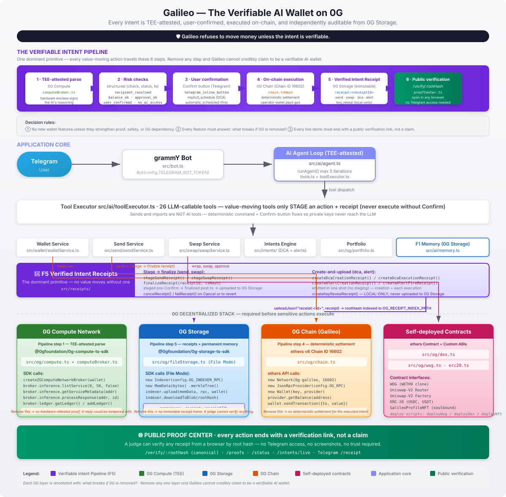

[](https://www.typescriptlang.org/)
[](https://0g.ai)
[](https://t.me/galileoOGbot)
[](LICENSE)
[](https://github.com/Jayanng/Galileo/actions)
[](0G-INTEGRATION.md)
[](https://t.me/galileoOGbot)
[]()
[](https://fly.io)

# 🛡️ Galileo – The Verifiable AI Wallet on 0G

<div align="center">

### Natural-language finance where every intent is TEE-attested, user-confirmed, executed on-chain, and independently auditable from 0G Storage.

**Galileo is the first verifiable AI wallet.** It is not a Telegram wallet that uses 0G —
it is a **verifiable intent layer for AI agents that move value.** Every financial action
travels a single primitive — *intent → TEE-attested parse → risk checks → user confirmation →
on-chain execution → 0G Storage receipt* — and ends with a **public verification link**,
not a claim.

> **Galileo refuses to move money unless the intent is verifiable.**

Talk to it in any language — Yoruba, Pidgin, Igbo, Hausa, French, Spanish, English, and more.
Create wallets, send, swap, schedule DCAs, arm price alerts — all by talking. But underneath
the chat surface, **0G is required before any sensitive wallet action can execute**, not
optional plumbing for memory and AI responses.

---

### 🎬 **[Try Galileo Now →](https://t.me/galileoOGbot)**

Open Telegram, message `@galileoOGbot`, and type:

```
create me a wallet
```

Then verify the action yourself, in any browser, by root hash:
[`/verify/:root`](https://galileo-test.fly.dev/verify/).

<!-- TODO: Replace with screenshot of a real Galileo conversation (e.g. "create me a wallet" → response). Save as docs/screenshots/welcome.png or similar. -->

<!-- TODO: Replace with a short GIF or video showing a full Galileo conversation ending with a public /verify/:root proof link. Save as docs/screenshots/demo.gif or demo.mp4. -->

---

[Features](#what-galileo-does) · [Why Galileo](#why-galileo-exists) · [Quick Start](#quick-start) · [Architecture](#how-its-built) · [0G Integration Reference](0G-INTEGRATION.md) · [Usage Reference](docs/USAGE.md) · [Testing Reference](docs/TESTING.md) · [Deploy Guide](DEPLOY.md) · [Project Structure](#project-structure) · [Roadmap](#roadmap)



</div>

---

## 🌍 Why Galileo Exists

Most AI wallets treat the LLM as a chatbot bolted onto a wallet. **Galileo treats the LLM as
an agent that moves value — and refuses to do so without a verifiable proof that the user
actually intended it.**

That is a different product. The defining question is not *"does it understand natural language?"*
(it does), but:

> **What breaks if 0G is removed?**

- **Without 0G Compute's TEE**, the AI's reasoning has no hardware-attested proof. A reply
  could be tampered with and no one could tell.
- **Without 0G Chain**, there is no deterministic settlement layer for the executed intent.
- **Without 0G Storage**, the receipt that proves *intent → parse → confirm → tx* has no
  immutable home — a judge cannot verify anything from a browser by root hash.

So 0G is not a feature of Galileo. **0G is the precondition for any sensitive action to execute.**

### 0G is load-bearing on every feature

| Feature | Without 0G | With 0G |
|---|---|---|
| **AI send** | Users trust mutable bot logs. | TEE-verified intent and public receipt. |
| **Swap** | Opaque AI suggestion and tx. | Verified route, user confirmation, archived receipt, tx link. |
| **DCA** | Trust a centralized scheduler. | Verifiable autonomous execution receipts. |
| **Memory** | Mutable database history. | Permanent audit history on 0G Storage with redaction/encryption. |
| **Recovery** | Server-dependent records. | Rebuild audit trail from Storage roots. |
| **Audit** | Screenshots or private logs. | Public root-hash verification. |

### Why Galileo can credibly claim this

- **Every word, verified** — every AI reply is signed by a hardware enclave (TEE) on 0G
  Compute. The proof lives on-chain. Tap `/proof` to see your last 10 verified chats.
- **Every action, receipted** — send, swap, DCA, alert, and key-reveal each emit a
  Verified Intent Receipt (F5) that lives on 0G Storage under its own root hash.
- **Every memory, permanent** — every interaction lives forever on 0G Storage. Ask
  *"what did I do last week?"* and get the right answer — even months later.
- **Talk to it in any language** — Yoruba, Pidgin, Igbo, Hausa, French, Spanish, English,
  and 3+ more. Built for the next billion users.

---

## ✨ Why Galileo Feels Easy

- **Just chat naturally:** "Create a new savings wallet" or "What's my balance?"
- **Works in your language** (English, Pidgin, Yoruba, French, and many more).
- **Remembers everything:** Ask "What did I do last week?" and it tells you — verified.
- **Safe by default:** Private keys never reach the LLM. Sensitive actions require an
  explicit Confirm button before anything moves on-chain.
- **Runs on your phone** — no new apps to learn.

**Underneath the chat surface, every action ends in a public verification link, not a claim.**

---

## 😌 No More Crypto Stress

Forget confusing websites and scary errors. Galileo removes the hard parts:

- **No need to copy long addresses.** Send money with a Telegram `@username`.
- **No fear of losing your history** — everything is saved safely on 0G Storage, verifiable by root hash.
- **No blind trust in the AI** — every action ships a receipt you can verify in a browser.

Just open Telegram and talk. That's it.

---

## 💡 What Galileo Does

Galileo is feature-rich under the hood, but the surface is one thing: **type what you want
and it happens — provably.** Every action below ends with a public verification link from
the Proof Center.

### 🛡️ The Verifiable Intent Pipeline

Every financial action travels the same primitive — one dominant primitive, not a bag of features:

```
natural-language intent
   │
   ▼
1. TEE-attested parse       ← 0G Compute (hardware enclave signs the AI's reasoning)
   │
   ▼
2. Risk checks              ← recipient_resolved · balance_ok · user_confirmed · approval_ok · …
   │
   ▼
3. User confirmation        ← Confirm button (or implicit_schedule for DCA/alerts)
   │
   ▼
4. On-chain execution       ← 0G Chain (tx hash, deterministic settlement)
   │
   ▼
5. Verified Intent Receipt  ← 0G Storage (immutable, root-hash-addressable)
   │
   ▼
6. Public verification link ← /verify/:rootHash — open in any browser, no Telegram access needed
```

> **Galileo refuses to move money unless the intent is verifiable.** Send, swap, DCA execution,
> alert fire, and key-reveal each emit a Verified Intent Receipt (F5) stored on 0G Storage
> under its own root hash. Use `/receipt` to list yours, or open any root hash at
> [`/verify/:root`](https://galileo-test.fly.dev/verify/).

### Decision rules (what gets built next)

- **No new wallet features unless they strengthen proof, safety, or 0G dependency.**
- **Every feature must answer: what breaks if 0G is removed?**
- **Every live demo must end with a public verification link, not a claim.**

### Feature tour

Here's what rides on top of that primitive — type what you want and it happens, provably:

### 💬 Just Talk

No commands to learn. The AI agent understands plain English (and Pidgin, Yoruba, French,
and 7+ more languages):

```
"create me a wallet"
"what's my balance?"
"send 0.1 OG to @tebasv2"
"what did I do last week?"
```

### 👛 Multi-Wallet Management — Your Wallets, Your Way

- Create multiple named wallets per user
- Import an existing wallet via private key (`/import`) — validated, previewed, and
  Confirm-gated; the key never touches the LLM or memory
- View addresses with QR codes
- Check OG + WOG + USDC + USDT balances
- Rename wallets anytime
- View private keys securely (one-tap hide)

### ⏰ Scheduled Intents (DCA + Alerts)

Set-and-forget money habits, just by talking:

```
"dca 1 OG into USDC weekly"          → weekly swap on schedule
"alert me if OG drops below $1"      → Telegram ping when price hits
```

- **DCA** — *"dca X <from> into <to> every <schedule>"*. Bot's worker ticks every 30s. Each scheduled swap fires automatically and emits a Verified Intent Receipt that links back to the original creation receipt — proving the rule was set up correctly *and* executed exactly as intended. (See [Verifiable DCA on 0G](#verifiable-dca-on-0g) below.)
- **Alerts** — *"alert me if <symbol> goes <operator> <price>"*. Fires once when met.
- **Manage** — `/intents`, `/cancel`, `/pause` with inline buttons.

### 🔄 Verifiable DCA on 0G

DCA turns Galileo from a chat wallet into an **autonomous, auditable finance agent**.
Each DCA rule lives on 0G Storage as an intent root, and every scheduled execution
links back to it via `creationReceiptId` — so a judge can verify the full chain from
*"user said 'swap 1 OG into USDC weekly'"* → *"rule was archived"* → *"each tick
executed on 0G Chain"* → *"each execution receipt links to the same parent root"*:

```
1. User says "dca 1 OG into USDC weekly" → TEE-attested parse → user confirms rule
2. Rule archived to 0G Storage as a creation receipt (its own root hash)
3. Worker ticks → validates balance, allowance, gas → executes swap on 0G Chain
4. Each execution emits a new receipt archived to 0G Storage
5. Proof Center links each child execution root back to the parent intent root
```

### 💱 Swap, Send, Wrap

- **Swap** OG↔USDC↔USDT↔WOG via DEX. *"Swap 0.1 OG to USDC"* → confirm → done → ends with a public verification link.
- **Send** to `@username` or `0x…` addresses with a Confirm button before any on-chain move → receipt links to `/verify/:root`.
- **Wrap/Unwrap** OG↔WOG. *"Wrap 1 OG"* or `/wrap 1`.

### 📊 Portfolio + P&L

- *"What's my portfolio worth?"* — All wallets, USD prices, grand total.
- *"Show my P&L this week"* — Daily snapshot table with % change.
- *"How many transactions have I done?"* — Total count, breakdown by type, volume per token.

### 🧠 Permanent Memory (F1)

Every interaction is permanently stored on 0G Storage. The bot remembers:

- All past messages and conversations
- Wallet creation history with timestamps
- Previous tool calls and their results
- On-chain transactions

Memory survives bot restarts. Ask *"what did I do yesterday?"* and get the right answer —
verifiable from the same 0G Storage root hash that backs every receipt.

### ♻️ Recovery — Rebuild From Storage Roots

If Galileo's server restarts, migrates, or loses local state, the full audit trail
rebuilds from 0G Storage root hashes — no server-dependent records, no trusted
snapshots:

- **Receipts** — recover any Verified Intent Receipt by root hash via
  [`/verify/:root`](https://galileo-test.fly.dev/verify/), even if the local index
  is wiped. Each receipt lives on 0G Storage under its own immutable root.
- **Conversation history** — the agent's memory layer rehydrates from 0G Storage on
  first message after a restart (`loadHistory` cold path). No user ever sees
  *"no record"* if the proof exists on Storage.
- **Scheduled intents** — DCA rules and alerts rehydrate from 0G Storage
  (`OgFileIntentStore.hydrate`), so a restart never silently drops a recurring
  swap or armed alert.
- **Wallets** — keys are AES-256-GCM encrypted at rest locally; the public
  address + metadata history rebuilds from 0G Storage. Keys never live on
  public immutable storage.

This is what "recovery from Storage roots" means in practice: zero trust in the
operator's server, full trust in the root hash.

### 🔐 TEE-Verified Replies

Every AI reply carries a verification footer:

```
✅ Verified in TEE — chatID: `0xabcd123456…ef5678`
```

The 0G Compute Network SDK signs each request and verifies the provider's TEE-signed
response. Verified chat IDs are persisted to 0G Storage alongside your conversation history —
send `/proof` to see the last 10. This is the first leg of the verifiable intent pipeline:
the AI's reasoning is hardware-attested before any action is allowed to execute.

### 🏛 Public Proof Center — Verifiable in Any Browser

Galileo ships a web-based audit dashboard. **Every action ends with a public verification
link, not a claim.** A judge can verify any receipt from a browser by root hash — no
Telegram access, no screenshots, no trust required:

| Route | Purpose |
|---|---|
| [`/verify/:root`](https://galileo-test.fly.dev/verify/) | Recover and verify a receipt from 0G Storage by root hash or user ID — the canonical end-of-demo link |
| [`/proofs`](https://galileo-test.fly.dev/proofs) | Live feed of system config, chain info, and audit trail |
| [`/status`](https://galileo-test.fly.dev/status) | Health dashboard — compute TEE status, chain block #, storage, uptime |
| [`/intents/live`](https://galileo-test.fly.dev/intents/live) | DCA & alert executions — status badges, timestamps, tx links to chainscan |

Every page includes the chain ID, evidence source status, and UTC timestamps. No framework,
no external CSS — minimal HTML that renders in any browser.

Access it directly from Telegram via the **🔍 Proof Center** button on the `/start` dashboard.

### 🔒 Security

- Private keys encrypted at rest (**AES-256-GCM**)
- Keys revealed only via explicit `/privatekey` command
- Operator wallet handles gas and storage writes
- Per-user wallets are independently generated

### 🎨 Profile NFT — Soulbound Identity

Every Galileo user gets a **soulbound ERC-721 profile NFT** minted automatically on their
first wallet creation. Non-transferable, on-chain proof of agent-hood.

- **One per user** — minted to the first wallet address, `GALPRO` symbol
- **Auto-mint** — zero user action required; the bot pays gas
- **Metadata** — creation date, wallet count, chain ID, anonymized user hash
- **0G Storage** — metadata JSON lives on decentralized storage (`0g://<rootHash>`)
- **Tools** — `get_profile_nft` views your badge, `get_leaderboard` shows total community size

Contract: `GalileoProfileNFT` on 0G Galileo at ``.

### 🌿 Self-Healing In-Memory Registry

The Telegram `@username → userId` registry lives in process memory as the **single source
of truth at runtime** — every incoming message refreshes it, so the index rebuilds organically
after every restart. Zero per-message latency, zero consistency checks, zero restoration drills.

When 0G Storage is enabled (`OG_STORAGE_ENABLED=true`), an **additive persistence layer**
keeps the registry warm across restarts. The in-memory API (`record()` / `lookup()` /
`count()` / `clear()`) is unchanged — persistence is opt-in and falls back to the original
behavior when disabled.

See [0G-INTEGRATION.md §3](0G-INTEGRATION.md#3-username-registry)
for the layered architecture diagram and design rationale.

### ⚡ Progressive UX

- Loading states for long operations
- Quick-action buttons for common tasks
- Smart message splitting (handles >4096 character responses)
- Typing indicators during LLM inference

### 🤖 AI Tools (the depth under the hood)

The agent exposes **23 LLM-callable tools** in `src/ai/tools.ts`, dispatched via
`src/ai/toolExecutor.ts`. Grouped by area:

- **Wallet CRUD** — `create_wallet`, `list_wallets`, `get_balance`, `get_wallet_address`,
  `get_wallet_details`, `get_wallet_timeline`, `get_total_og`, `rename_wallet`, `delete_wallet`
- **Portfolio + pricing** — `get_portfolio`, `get_price`, `transaction_stats`
- **Memory + proofs** — `search_history`, `get_proofs`
- **Scheduled intents** — `dca_create`, `alert_create`, `list_intents`, `manage_intent`
  (one tool handling `cancel` / `pause` / `resume`)
- **Swaps** — `swap` (stages a wrap/unwrap or DEX swap; never executes without Confirm)
- **On-chain explainers (read-only)** — `explain_contract`, `explain_transaction`
- **Profile NFT** — `get_profile_nft` (view your soulbound badge), `get_leaderboard` (community size)

> **Why sends, imports, and key reveal are not AI tools:** sending funds, importing wallets,
> and revealing private keys run through deterministic command + Confirm-button flows
> (`/send`, `/import`, `/privatekey`) so private keys never enter conversation history or
> 0G Storage memory snapshots. This is a deliberate safety property — keys never reach the
> LLM, so the TEE-attested agent cannot exfiltrate them.

---

## 🚀 Quick Start

### Prerequisites

- **Node.js ≥20** (developed on 22)
- **Telegram bot token** — get one from [@BotFather](https://t.me/BotFather)
- **Operator wallet** — funded with testnet OG from the [0G faucet](https://faucet.0g.ai)
- **0G Compute API key** — get one at [pc.testnet.0g.ai](https://pc.testnet.0g.ai) (deposit
  ~0.05 OG to activate)

### Installation

```bash
# Clone the repository
git clone https://github.com/Jayanng/Galileo.git
cd Galileo

# Install dependencies
npm install

# Configure environment
cp .env.example .env
```

### Required Environment Variables

The four must-haves are:

```env
TELEGRAM_BOT_TOKEN=your_bot_token_from_botfather
OPERATOR_PRIVATE_KEY=your_operator_wallet_key
WALLET_ENCRYPTION_KEY=a_long_random_secret_key_16_chars_min
OG_COMPUTE_API_KEY=your_key_from_pc_testnet_0g_ai
```

**📖 Full configuration reference (every variable + default + description):**
**[DEPLOY.md → Configuration Reference](DEPLOY.md#configuration-reference)**

### Run

```bash
# Development (watch mode)
npm run dev

# Production
npm start

# Type-check
npm run typecheck

# Run tests
npm test
```

### First Use

Open Telegram and message your bot:

```
create me a wallet
```

The bot will create a wallet, show you the address and private key, and ask you to name it.
Then verify the action yourself — open any receipt's root hash at
[`/verify/:root`](https://galileo-test.fly.dev/verify/). That's it — you're set, and the
proof is public.

---

## 🏗 How It's Built

```
┌─────────────────────────────────────────────────────────┐
│                      Telegram                           │
│                    (grammY Bot)                          │
└─────────────────────┬───────────────────────────────────┘
                      │
┌─────────────────────▼───────────────────────────────────┐
│                   handler layer                          │
│                                                         │
│  ┌─────────────────┐  ┌──────────────────────────────┐  │
│  │ walletHandlers  │  │         aiHandler             │  │
│  │ (commands +     │  │  (natural language routing)   │  │
│  │  button taps)   │  │                               │  │
│  └────────┬────────┘  └──────────────┬────────────────┘  │
└───────────┼──────────────────────────┼────────────────────┘
            │                          │
┌───────────▼──────────────────────────▼────────────────────┐
│                    agent layer                             │
│                                                           │
│  ┌──────────────────────────────────────────────────────┐ │
│  │              runAgent() loop                          │ │
│  │  1. Build system prompt + memory context             │ │
│  │  2. Call 0G Compute (LLM) with tool definitions      │ │
│  │  3. Execute tool calls via toolExecutor               │ │
│  │  4. Loop until LLM produces final answer (max 3)     │ │
│  │  5. Persist interaction to 0G Storage                │ │
│  └──────────────────────────────────────────────────────┘ │
│                           │                                │
│  ┌────────────────────────▼───────────────────────────┐   │
│  │  tools.ts · toolExecutor.ts · systemPrompt.ts      │   │
│  │  memory.ts · fileStorage.ts                        │   │
│  └────────────────────────────────────────────────────┘   │
└──────────────────────────┬─────────────────────────────────┘
                           │
┌──────────────────────────▼─────────────────────────────────┐
│                   service layer                             │
│                                                             │
│  ┌──────────────┐  ┌──────────────┐  ┌──────────────────┐  │
│  │ walletService │  │   crypto.ts  │  │    walletStore   │  │
│  │ (F4 wallet    │  │ AES-256-GCM  │  │  local encrypted  │  │
│  │  generator)   │  │ encrypt/     │  │  persistence     │  │
│  │               │  │ decrypt      │  │                  │  │
│  └──────┬───────┘  └──────────────┘  └──────────────────┘  │
└─────────┼───────────────────────────────────────────────────┘
          │
┌─────────▼───────────────────────────────────────────────────┐
│                   0G blockchain layer                        │
│                                                             │
│  ┌──────────────┐  ┌──────────────┐  ┌──────────────────┐  │
│  │  chain.ts    │  │  compute.ts  │  │  fileStorage.ts  │  │
│  │ ethers v6    │  │ OpenAI SDK   │  │ 0G Storage File  │  │
│  │ RPC provider │  │ 0G Compute   │  │ Indexer          │  │
│  └──────────────┘  └──────────────┘  └──────────────────┘  │
└─────────────────────────────────────────────────────────────┘
```

### Data Flow

The agent loop below is the **read path** (memory, balance, portfolio, explainers). The
**write path** for any action that moves value follows the [Verifiable Intent Pipeline](#-the-verifiable-int-pipeline) instead — it stages a receipt, requires a Confirm tap,
executes on-chain, and uploads the finalized receipt to 0G Storage before returning a
verification link.

1. **User sends message** → `aiHandler` receives the text; `bot.ts` middleware passively
   records `@username` into the [Username Index](0G-INTEGRATION.md#3-username-registry)
2. **History loaded** → Past interactions fetched from 0G Storage (or in-memory cache)
3. **Memory context built** → Recent + earliest entries formatted for LLM context
4. **LLM inference** → 0G Compute processes the prompt with tool definitions (TEE-attested)
5. **Tool execution** → If LLM requests a tool (create wallet, check balance, etc.),
   `toolExecutor` dispatches it. Value-moving tools only *stage* an action + receipt.
6. **Result loop** → Tool results fed back to LLM for final response
7. **Persistence** → Interaction saved to 0G Storage (best-effort, non-blocking)
8. **Reply** → Response sent to user with quick-action buttons. For value moves, the reply
   is a Confirm button — nothing settles until the user taps it, after which the finalized
   receipt's root hash becomes the public verification link.

### Tech Stack

| Category | Technology |
|---|---|
| **Runtime** | Node.js ≥20, TypeScript 5.7 |
| **Bot Framework** | grammY (Telegram) |
| **Blockchain** | ethers v6, 0G Galileo testnet |
| **AI Inference** | 0G Compute Router (OpenAI-compatible) |
| **AI Model** | Qwen 2.5 Omni 7B |
| **Storage** | 0G Storage (File Mode) |
| **Encryption** | AES-256-GCM |
| **Validation** | zod |
| **Dev Tools** | tsx (TypeScript executor), tsd (typecheck) |

### Overview — The Stack at a Glance

| Layer | Technology | Role in the verifiable intent pipeline |
|---|---|---|
| **Chain** | 0G Galileo testnet (Chain ID 16602) | Deterministic settlement for the executed intent (step 4) |
| **Compute** | 0G Compute Network SDK (TEE-verifiable LLM inference) | Hardware-attested parse of natural-language intent (step 1) |
| **Storage** | 0G Storage (permanent, immutable) | Home of the Verified Intent Receipt + permanent memory (step 5 → `/verify/:root`) |
| **AI Model** | Qwen 2.5 Omni 7B (via 0G Compute) | The agent whose every reply is TEE-signed |

Remove any one of these three layers and Galileo can no longer credibly claim to be a
verifiable AI wallet — which is the point. Users still create wallets, check balances, view
addresses, rename wallets, and recall past activity by typing plain English (or Pidgin,
Yoruba, French, and 7+ other languages) — but no value moves without the full pipeline.

---

## 📚 Documentation Map

This README is the **front door** — the pitch (verifiable AI wallet), the dominant primitive
(the Verifiable Intent Pipeline), and the high-level feature tour. For deep reference
material, the docs are one click away:

| What you want | Where to go |
|---|---|
| **Every command + natural language pattern + multi-language examples** | **[docs/USAGE.md](docs/USAGE.md)** |
| **Test suite, CI matrix, debug scripts** | **[docs/TESTING.md](docs/TESTING.md)** |
| **Full env-var reference + secrets + deploy to Fly.io** | **[DEPLOY.md](DEPLOY.md)** |
| **0G stack depth — why each layer is required, not optional** | **[0G-INTEGRATION.md](0G-INTEGRATION.md)** |

---

## 📂 Project Structure

```
src/
├── index.ts                  # Entry point: config, hydrate username index, compute broker, health server, intents worker, start bot
├── config.ts                 # Zod-validated environment config
├── bot.ts                    # grammY bot setup + routing
├── health.ts                 # /health + /proofs HTTP endpoints
├── proofCenter.ts            # Public audit dashboard (/proofs, /status, /intents/live, /verify/:root — canonical verification link)
├── faq.ts                    # /help FAQ text
├── helpContent.ts            # Shared /help + onboarding copy
│
├── og/
│   ├── compute.ts            # 0G Compute Router client (OpenAI-compatible, fallback)
│   ├── computeBroker.ts      # 0G Compute broker (TEE-verifiable inference, default)
│   ├── chain.ts              # ethers v6 provider + operator wallet
│   ├── fileStorage.ts        # 0G Storage File Mode (rolling snapshots)
│   ├── portfolio.ts          # Portfolio aggregation + USD pricing + snapshot types
│   ├── prices.ts             # CoinGecko USD price feed (60s cache)
│   ├── dex.ts                # Uniswap-V2 router/factory wrappers
│   ├── erc20.ts              # ERC-20 helpers (allowance, transfer)
│   ├── wog.ts                # WOG (WETH9 clone) wrap/unwrap helpers
│   ├── contractExplorer.ts   # Read-only address inspection (backs explain_contract)
│   ├── transactionExplorer.ts# Read-only tx-hash inspection (backs explain_transaction)
│   └── nftService.ts          # Profile NFT mint, query, metadata update (backs get_profile_nft)
│
├── ai/
│   ├── agent.ts              # Tool-calling agent loop (max 3 iterations)
│   ├── tools.ts              # Tool definitions (23 tools)
│   ├── toolExecutor.ts       # Dispatches LLM tool calls to services
│   ├── systemPrompt.ts       # Bot persona, behavior rules, multilingual
│   ├── memory.ts             # F1: permanent memory (0G Storage snapshots)
│   └── memory.test.ts
│
├── analytics/
│   └── snapshot.ts           # Daily portfolio snapshots (local file, /history backend)
│
├── intents/                  # Scheduled intents subsystem (DCA + price alerts)
│   ├── index.ts              # Barrel export
│   ├── types.ts              # DcaIntent / AlertIntent types
│   ├── intentStore.ts        # Intent persistence (local + optional 0G Storage)
│   ├── schedule.ts           # Schedule parsing + next-run computation
│   ├── executor.ts           # Executes a due DCA / evaluates an alert
│   └── worker.ts             # 30s polling worker (startIntentWorker)
│
├── handlers/
│   ├── aiHandler.ts          # Natural language handler (AI agent entry point)
│   ├── walletHandlers.ts     # Wallet command handlers + quick-action buttons
│   ├── importHandlers.ts     # /import flow (prompt → preview → Confirm/Cancel)
│   ├── portfolioHandlers.ts  # /portfolio, /price, /history
│   ├── proofHandler.ts       # /proof command (recent TEE-verified chats)
│   ├── receiptHandler.ts     # /receipt — lists a user's Verified Intent Receipts
│   ├── swapHandlers.ts       # Swap Confirm/Cancel callbacks
│   ├── swapUiHandlers.ts     # /swap command + deterministic swap parsing
│   ├── sendHandlers.ts       # Send Confirm/Cancel callbacks
│   ├── sendUiHandlers.ts     # /send command + deterministic send parsing
│   ├── sendUiHandlers.test.ts
│   ├── intentHandlers.ts     # /intents Confirm/Cancel/Pause callbacks
│   └── intentUiHandlers.ts   # /intents, /cancel, /pause command UI
│
├── wallet/
│   ├── crypto.ts             # AES-256-GCM encrypt/decrypt
│   ├── crypto.test.ts        # Crypto unit test
│   ├── walletStore.ts        # Local + 0G-backed encrypted persistence
│   ├── walletService.ts      # Wallet generation, balance, rename, assets, tx count
│   ├── import.ts             # Import-by-private-key: state, validation, service
│   ├── activeWallet.ts       # Active-wallet selection per user
│   ├── namingState.ts        # Wallet naming flow state management
│   ├── swapState.ts          # Per-user swap-amount waiting state
│   ├── sendState.ts          # Per-user send-amount waiting state
│   ├── recipientResolver.ts  # @handle / 0x... → wallet address resolution
│   ├── recipientResolver.test.ts
│   ├── usernameIndex.ts      # @handle → userId index (in-memory + optional 0G)
│   └── usernameIndex.test.ts
│
├── swap/
│   ├── swapService.ts        # Swap orchestration (prepare/execute)
│   └── pendingSwap.ts        # Pending-swap state for Confirm buttons
│
├── send/
│   ├── sendService.ts        # Send orchestration (prepare/execute)
│   └── pendingSend.ts        # Pending-send state for Confirm buttons
│
├── receipts/                 # F5: Verified Intent Receipts — the verifiable intent primitive
│   ├── types.ts              # Zod schema for send/swap/dca/alert/key_reveal receipts
│   ├── receiptService.ts     # Stage → finalize → emit (uploads to 0G Storage, indexes root hash)
│   ├── receiptStore.ts       # Local index: receiptId → { rootHash, userId, actionType, status }
│   └── index.ts              # Barrel export
│
└── util/
    └── qr.ts                 # Address → QR PNG generator

contracts/
└── GalileoProfileNFT.sol     # Soulbound ERC-721 profile NFT

scripts/
└── deployNft.mjs             # One-shot GalileoProfileNFT deployer
```

---

## 🧭 Roadmap

> **Decision rule:** no new wallet features are added to this list unless they strengthen
> proof, safety, or 0G dependency. Every planned item must answer *what breaks if 0G is
> removed?* and every live demo of it must end with a public verification link.

| Feature | Status |
|---|---|
| **F5** Verifiable AI Receipts — the dominant primitive | ✅ Complete (send + swap + DCA + alert + key-reveal receipts, all on 0G Storage) |
| **F4** On-Chain Wallet Generator | ✅ Complete |
| **F2** Conversational AI Agent (TEE-attested) | ✅ Complete |
| **F1** Infinite Memory (0G Storage) | ✅ Complete |
| **F7** Multi-Language Support | ✅ Complete |
| **UX** Quick-action buttons, loading states, message splitting | ✅ Complete |
| **F3** Verifiable AI Portfolio Advisor | ✅ Complete (`/portfolio`, `/price`, `/history` + `transaction_stats` tool) |
| **DEX** Demo Uniswap-V2 + mock USDC/USDT on 0G Galileo | ✅ Complete |
| **Wallet Import** Bring an existing wallet via private key (`/import`, Confirm-gated) | ✅ Complete |
| **On-Chain Explainers** `explain_contract` + `explain_transaction` read-only lookups | ✅ Complete |
| **Username Registry Persistence** | ✅ Complete (in-memory + optional 0G Storage layer, gated by `OG_STORAGE_ENABLED`) |
| **Scheduled Intents** DCA + price alerts via polling worker | ✅ Complete (`/intents`, `/cancel`, `/pause` + 4 AI tools; ticks every 30s, survives restarts via 0G Storage) |
| **Profile NFT** Soulbound ERC-721 per user (`GALPRO`), auto-mint on first wallet | ✅ Complete |
| **Proof Center** Web-verifiable audit dashboard at `/proofs`, `/status`, `/intents/live`, `/verify/:root` | ✅ Complete |
| **F6** Smart Link / Action Generator | ⏳ Planned (must emit a verifiable receipt) |
| **Telegram Mini-App Dashboard** — Portfolio, history, proof as embedded WebApp | ⏳ Planned (must surface the `/verify/:root` link) |
| **One-Tap Proof** — Share verified 0G transactions easily | ⏳ Planned (strengthens proof) |
| **Multi-Agent Sub-Personalities** — Trader/Analyst/Security/Tax modes with auto-routing | ⏳ Planned (every agent turn must remain TEE-attested) |
| **Voice Messages** — Talk instead of typing | ⏳ Planned |
| **Family & Group Wallets** — Shared wallets for family and groups | ⏳ Planned (must preserve per-user receipts) |
| **Smart Savings Plans** — Automated recurring savings by talking | ⏳ Planned (extends the DCA primitive) |
| **Multi-Chain Support** — Send money across different networks | ⏳ Planned (receipts must remain 0G Storage-rooted) |
| **Personal AI Tips** — Gentle spending and usage insights | ⏳ Planned |

---

## 🛠 Development

```bash
# Watch mode (auto-restart on changes)
npm run dev

# Type-check only
npm run typecheck

# Run tests (discovers and runs every scripts/test-*.mjs)
npm test
```

**📖 Full testing reference (test files, CI matrix, debug scripts):**
**[docs/TESTING.md](docs/TESTING.md)**

### Continuous Integration

`.github/workflows/ci.yml` runs on every push/PR to `Master`:

- **Lint + Typecheck** (`npm run typecheck`)
- **Test** (`npm test`)
- Matrix: **Node.js 20** and **Node.js 22**

The badge at the top of this README reflects the latest CI run. Full CI details and the
debug scripts inventory live in **[docs/TESTING.md](docs/TESTING.md)**.

---

## 📜 License

[MIT](LICENSE)

---

<div align="center">
Built with ❤️ for the 0G ecosystem · <a href="https://0g.ai">0g.ai</a><br/>
<sub>Galileo — the verifiable AI wallet on 0G. Every intent is TEE-attested, user-confirmed, executed on-chain, and independently auditable from 0G Storage.</sub>
</div>
